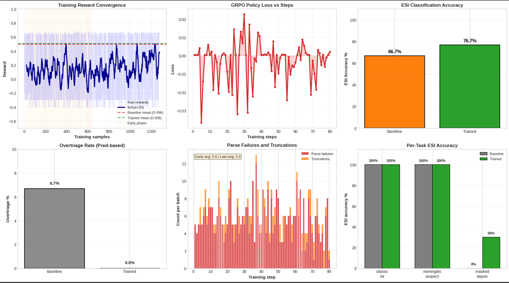
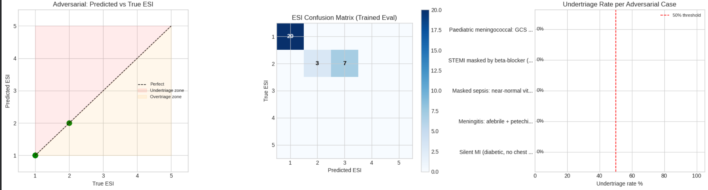

# Medical Triage Environment

An OpenEnv benchmark for emergency department triage using the Emergency Severity Index (ESI 1-5).

- Training notebook: [Mavericks_Final_Training](https://colab.research.google.com/drive/1oiuvanrteVoE3F8pCNOIdi5t8gierS_e?usp=sharing#scrollTo=9288a425) - full model training and evaluation workflow.
- Hugging Face Space: [medical-triage-env](https://vishaltechie-medical-triage-env.hf.space) - live demo of the triage environment.
- Blog: https://huggingface.co/spaces/VishalTechie/medical-triage-env/blob/main/Blog.MD
## Overview
The agent receives structured patient presentations and must either classify urgency or request a clarifying question when additional history is needed. The benchmark emphasizes triage prioritization, clinical reasoning, and safe escalation.

## Notebook Results

The `Mavericks_Final_Training` notebook trains a small LoRA-adapted `unsloth/Qwen2.5-1.5B-Instruct` model with GRPO and evaluates it on the triage environment.





The training plot shows the main outcome: baseline mean reward of 0.496 rising to 0.506 after training, with ESI accuracy improving from 66.7% to 76.7%.

The adversarial plot shows a cleaner safety profile: no dangerous undertriage in the stress set, with the confusion matrix still revealing where the model tends to overpredict urgency.

## Tasks
| Task ID | Difficulty | Scenario | Correct ESI |
|---|---|---|---|
| classic-mi | Easy | STEMI with hypotension, diaphoresis, and chest pain | 1 |
| meningitis-suspect | Medium | Suspected meningococcal meningitis with petechiae | 1 |
| masked-sepsis | Hard | Elderly urosepsis masked by beta-blockade and CKD | 2 |

## Reward Summary
- ESI accuracy: 50% of reward
- Reasoning quality: 30% of reward
- Action appropriateness: 20% of reward
- Undertriage penalty: severe penalty for dangerous low-acuity assignments
- Clarify reward: encourage targeted questions when more information is needed
- Formatting penalty: discourage malformed outputs

## Actual Results

| Metric | Baseline | Trained |
|---|---:|---:|
| Mean reward | 0.496 | 0.506 |
| ESI accuracy | 66.7% | 76.7% |
| Undertriage rate | 6.7% | 0.0% |
| Overtriage rate | 0.0% | 0.0% |

| Task | Baseline ESI accuracy | Trained ESI accuracy |
|---|---:|---:|
| classic-mi | 100% | 100% |
| meningitis-suspect | 100% | 100% |
| masked-sepsis | 0% | 30% |

### Adversarial Checks

- Silent MI, afebrile meningitis, and masked sepsis were used as stress tests.
- The notebook reports 0% undertriage across the adversarial cases shown in the plot.
- The remaining weakness is masked sepsis, which still lags behind the simpler cases.

## Setup
```bash
pip install -r requirements.txt
docker build -t medical-triage-env .
docker run -p 8000:8000 medical-triage-env
openenv validate
python inference.py
```

## Environment Variables
- `API_BASE_URL`
- `API_KEY`
- `MODEL_NAME`
- `BASE_URL`

Use `.env` only for local development. Do not commit secrets.
